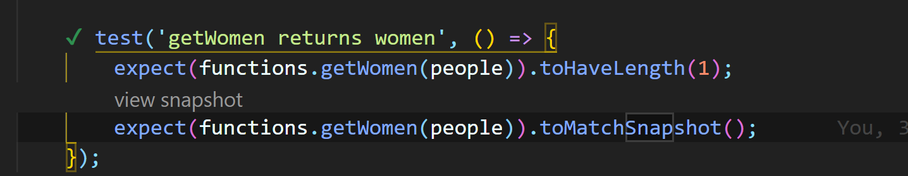
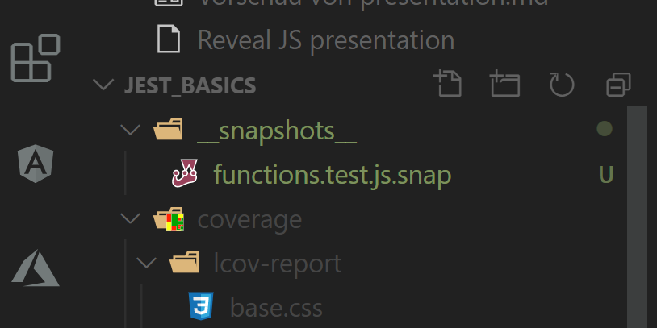
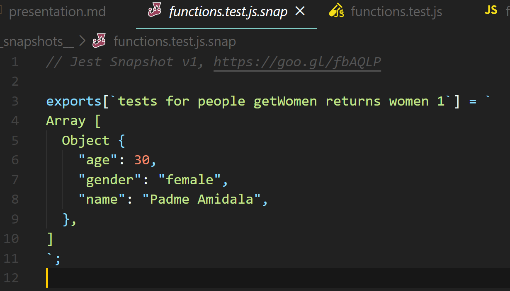
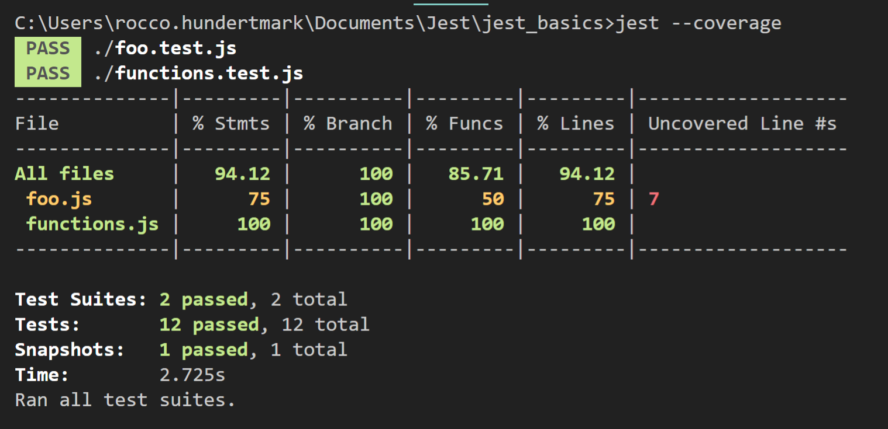
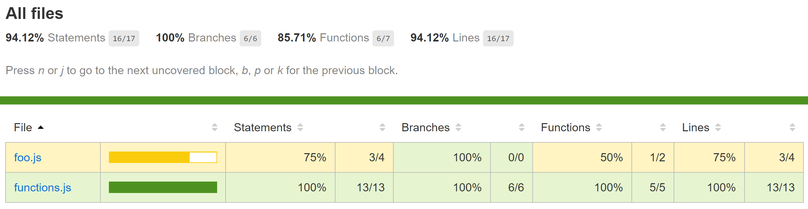
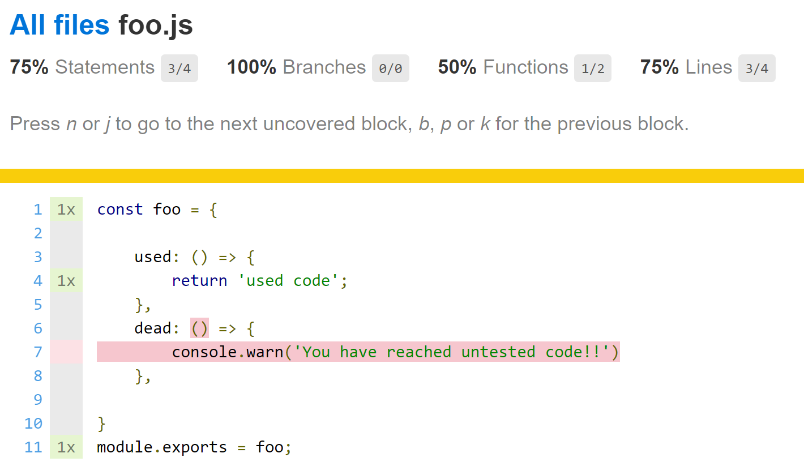

// @ [Rocco Hundertmark](https://github.com/1337-5P34Ker)

// repo https://github.com/1337-5P34Ker/jest 

---

#### Why JEST?
All in one Framework
* test runner
* assertion library
* mocking
* code-coverage
* snapshots
* readable errors
* minimal config
* fast (parallelzation)
* IDE support (VS Code)

---


#### How to install

```
npm init
npm install --save-dev --global jest
npm install --save @types/jest
```
---

#### Syntax (Matchers)

more than 50 matchers avail.
(https://jestjs.io/docs/en/using-matchers)
```js
// Common
.toBe(value)
.toEqual(value)
...
// Truthiness
.toBeDefined()
.toBeFalsy()
...
// Numbers
.toBeGreaterThan(3);
.toBeGreaterThanOrEqual(3.5);
.toBeLessThan(5);
...
// Strings
.toMatch(regExp)
...
// Arrays and iterables
.toContain()
...
// Exceptions
.toThrow('Yoda is not a Sith');
.toThrow(/JEDI/); // any error with 'JEDI'
...
// Mocks
 .toHaveBeenCalled() 
 .toHaveBeenCalledWith(arg1, arg2);
 ...
```

--

#### Syntax (Methods)


```js

 describe('description for this tests', () => {
    beforeAll('runs before tests in this describe-block run' () => {
   // clear DB
    })

    beforeEach('runs before each test runs' () => {
   // set init values
    })

    afterEach(fn, timeout)...
    afterAll(fn, timeout)...
    test(name, fn)
    test.only()
    test.skip()
    test.each([])
    test.todo('Yes, I will...')
    ...
 })

```

---


## Testing

// package.json
```js
 "scripts": {
    "test": "jest",
    "cover": "jest --coverage"
  },
```
// CLI
```js
 npm run test  
```
 or (if --global)
```js
 jest 
```

--

#### Code

// functions.js
```js
 const functions = {
    add: (a, b) => a + b
}

module.exports = functions;
```

--

#### Test
// functions.**_test_**.js

```js
 const functions = require('./functions'); // import

test('adds 1 + 2 to equal 3', () => {
    expect(functions.add(1, 2)).toBe(3);
});
```

--

#### Result
// Terminal


---

#### Snapshots 

Jest creates snapshots from all serializable objects to compare with.



--

The serialized objects (e.g. HTML, JSON...) are stored in files in a special folder 



--

 If snapshot is not matching...

 

--

// functions.test.js.snap


 
---

#### Coverage

```js
jest --coverage
```

Jest shows a table to visualize the code coverage.


--

And it also creates a complete (linked) HTML report.


--



---

#### Mocking

Mocking is very useful to test function calls. To check the invocation with its parameters and return values. And also to mock return values.

```js
const myMock = jest.fn()
// Fake return values for call 1, 2 and all others
myMock.mockReturnValueOnce(42)
      .mockReturnValueOnce('Darth Vader')
      .mockReturnValue(true);

console.log(myMock(), myMock(), myMock(), myMock());
// > 42, 'Darth Vader', true, true
```

--

Mocking a function

```js
const myMock = jest.fn(x => x + 5);
console.log(myMock)
  // > undefined

const values = [0, 1, 2];
values.forEach(myMock);

// function was called 3 times
expect(myMock).toBeCalledTimes(3);

 // the first argument of the first call was 0
expect(myMock.mock.calls[0][0]).toBe(0);

 // The return value of the second call was 6 (1 + 5)
expect(myMock.mock.results[1].value).toBe(6);

```

--

Mocking a timer

```js
// fake setTimeout
  jest.useFakeTimers();
  const callback = jest.fn();

  functions.waitASecond(callback);
  
  expect(setTimeout).toHaveBeenCalledTimes(1);
  expect(setTimeout).toHaveBeenCalledWith(expect.any(Function), 10000);
  expect(callback).not.toHaveBeenCalled();
 
  jest.runAllTimers(); // time is over
  expect(callback).toHaveBeenCalled(); // callback is called

```