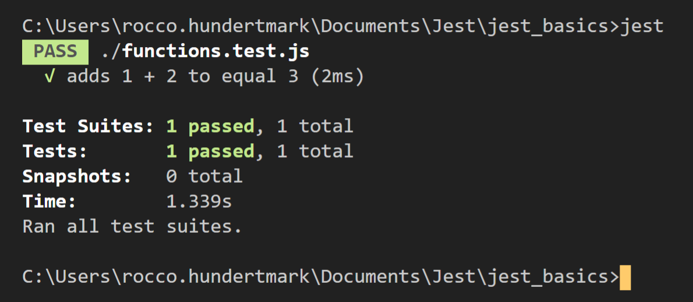

// @ [Rocco Hundertmark](https://github.com/1337-5P34Ker)

// repo https://github.com/1337-5P34Ker/jest 

---

#### Why JEST?
All in one Framework
* test runner
* assertion library
* mocking
* code-coverage
* snapshots
* readable errors
* minimal config
* fast (parallelzation)
* IDE support (VS Code)

---


#### How to install

```
npm init
npm install --save-dev --global jest
npm install --save @types/jest
```
---

#### Syntax ("matchers")

more than 50 matchers avail.
(https://jestjs.io/docs/en/using-matchers)
```js
 expect(value)
 .toBe(value)
 .toHaveBeenCalled()
 .toBeDefined()
 .toBeFalsy()
 .toContain(item)
 .toEqual(value)
 .toMatch(regExp)
 ...
```
---


## Testing

// package.json
```js
 "scripts": {
    "test": "jest",
    "cover": "jest --coverage"
  },
```
// CLI
```js
 npm run test  
```
 or (if --global)
```js
 jest 
```

--

#### Code

// functions.js
```js
 const functions = {
    add: (a, b) => a + b
}

module.exports = functions;
```

--

#### Test
// functions.**_test_**.js

```js
 const functions = require('./functions'); // import

test('adds 1 + 2 to equal 3', () => {
    expect(functions.add(1, 2)).toBe(3);
});
```

--

#### Result
// Terminal



